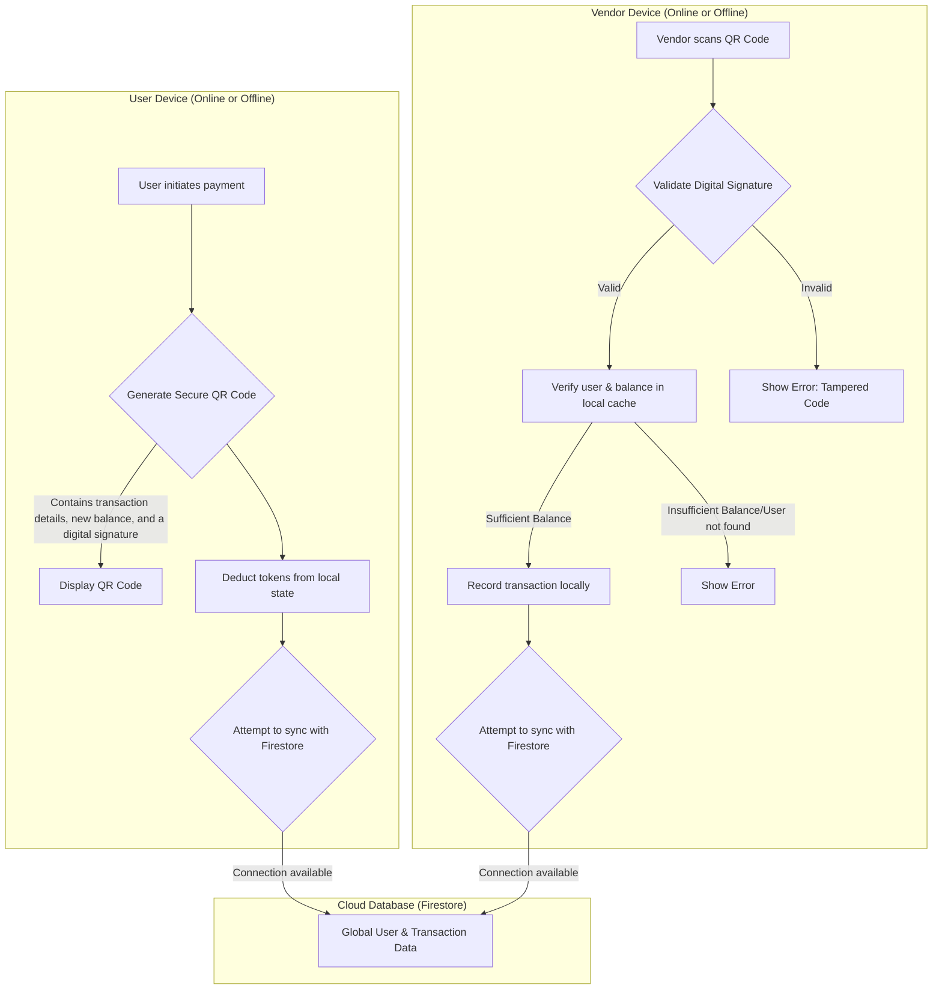

# CanteenPass

CanteenPass is a modern, offline-first smart canteen management application built with Next.js, Firebase, and Tailwind CSS. It provides a seamless experience for users, vendors, and administrators to manage canteen tokens and transactions.

## Features

- **User Dashboard:** View balance, transaction history, and generate QR codes for payment.
- **Vendor Mode:** Scan user QR codes to securely validate and process payments, even offline.
- **Admin Panel:** Manage users, distribute tokens, and view comprehensive reports.
- **Progressive Web App (PWA):** Installable on mobile devices for a native-app-like experience.
- **Offline-First:** Core payment functionality works without an internet connection, syncing automatically when back online.

## Architecture and Scalability

This application is built to be highly scalable and resilient, capable of handling tens of thousands of users simultaneously. This is achieved through its modern architecture leveraging serverless and cloud-native technologies.

### Database: Firebase Firestore

The backend is powered by **Google Firebase Firestore**, a cloud-hosted NoSQL database. Firestore is designed for global scale and provides several key features that make it ideal for this application:

- **Real-time Synchronization:** Data is synced across all clients (user and vendor devices) in real-time. A transaction made on one device is instantly visible on all others.
- **Massive Scalability:** As a managed service from Google Cloud, Firestore automatically handles the infrastructure required to support millions of users, including 50,000+ concurrent connections, without any manual intervention.
- **Offline Persistence:** The Firestore SDK provides robust offline data persistence. If a user or vendor loses their internet connection, the app continues to function using a local cache. Any changes made offline are automatically synchronized with the server once connectivity is restored.
- **Secure Access:** Security is enforced through Firestore Security Rules, ensuring that users can only access and modify their own data.

### Data Flow Chart

The following chart illustrates how a transaction is processed, highlighting both the online and offline capabilities of the system.



This hybrid online/offline model ensures that the canteen can continue to operate smoothly, regardless of network conditions.

## Getting Started

To get a local copy up and running, follow these simple steps.

### Prerequisites

You will need to have Node.js and npm (or a similar package manager) installed on your machine.

### Installation

1. Clone the repository to your local machine.
2. Navigate into the project directory:
   ```sh
   cd canteen-pass
   ```
3. Install the required NPM packages:
   ```sh
   npm install
   ```

### Running the Application

To run the application in development mode, execute the following command. This will start the local server, typically on `http://localhost:3000`.

```sh
npm run dev
```

Now you can open your browser and navigate to the local server address to see the application in action.
